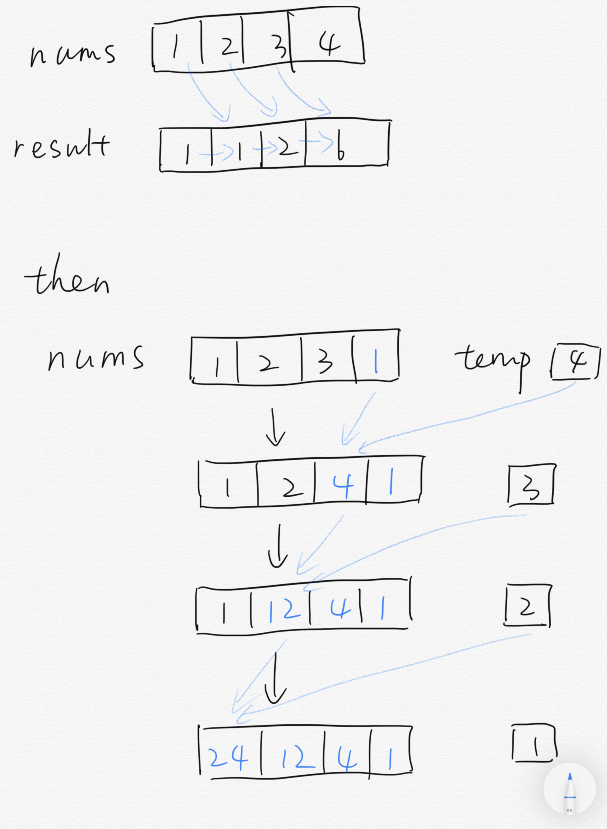

## 题目描述

给你一个长度为 n 的整数数组 `nums`，其中 n > 1，返回输出数组 output ，其中 `output[i]` 等于 `nums` 中除 `nums[i]` 之外其余各元素的乘积。

提示：题目数据保证数组之中任意元素的全部前缀元素和后缀（甚至是整个数组）的乘积都在 32 位整数范围内。

说明: 请不要使用除法，且在 O(n) 时间复杂度内完成此题。

进阶：
你可以在常数空间复杂度内完成这个题目吗？（出于对空间复杂度分析的目的，输出数组不被视为额外空间。）

## 思路

因为不能使用除法，所以就只能用乘法思路。考虑到


后续的两个乘数可以用数组存储。由于输入数组和输出数组不算在空间复杂度范围，于是可以将


存入输出数组中，将


存入输入数组中。

展开累乘，对输出数组中的元素而言，满足


对输入数组中的元素，满足


使用空间复杂度为常数的辅助变量，在原地计算即可。

代码中的实现细节可参考下图：



最后，对  中的每一项，乘上  中的数值即可返回。

## 代码

```cpp
class Solution {
public:
    vector<int> productExceptSelf(vector<int>& nums) {
        vector<int> result;
        result.push_back(1);
        for (int i = 1; i < nums.size(); i++) {
            result.push_back(result[i - 1] * nums[i - 1]);
        }
        int temp = nums[nums.size() - 1];
        int swap;
        nums[nums.size() - 1] = 1;
        for (int i = nums.size() - 2; i >= 0; i--) {
            swap = temp;
            temp = nums[i];
            nums[i] = swap * nums[i + 1];
            result[i] *= nums[i];
        }
        return result;
    }
};
```